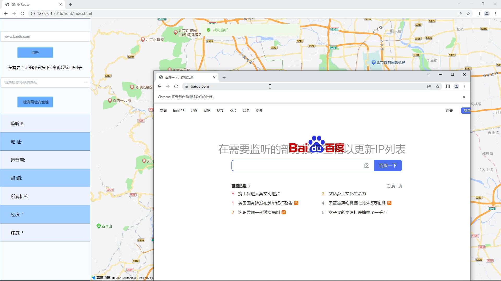
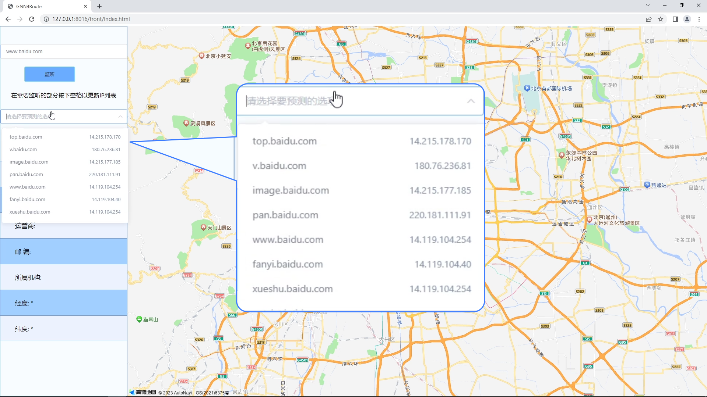
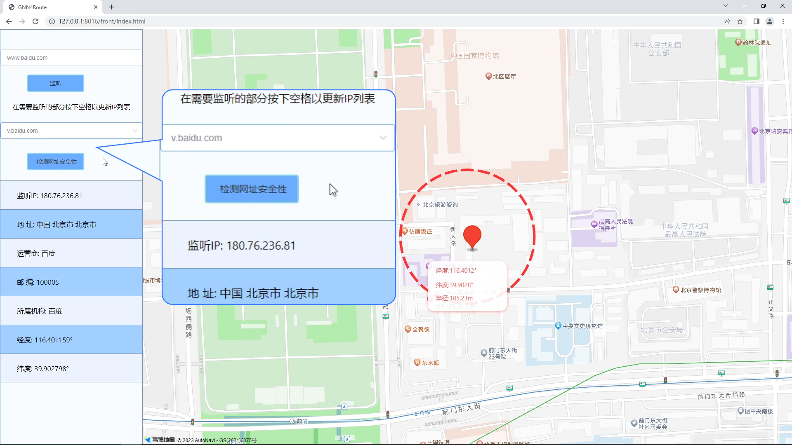
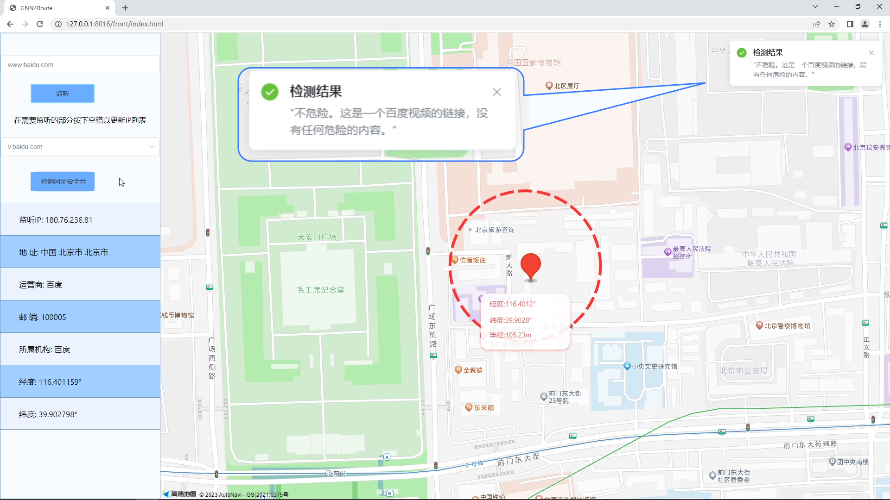
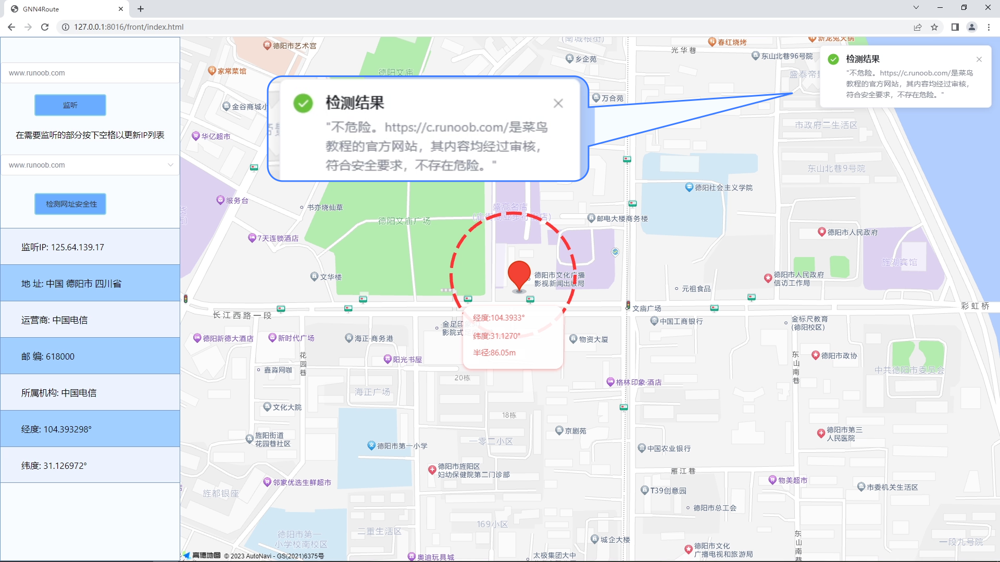
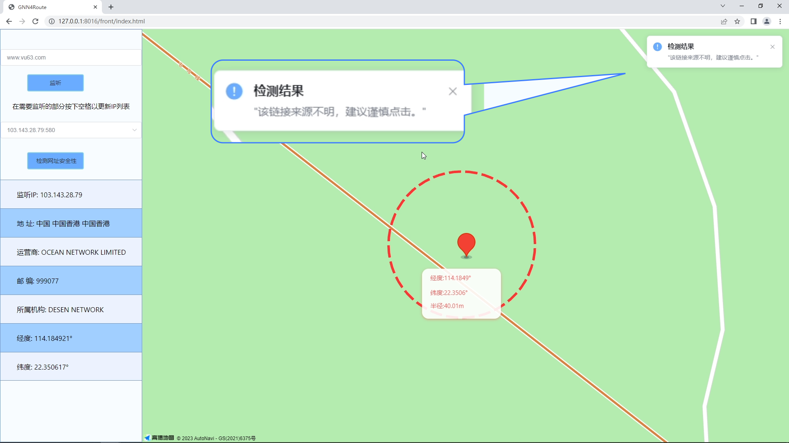
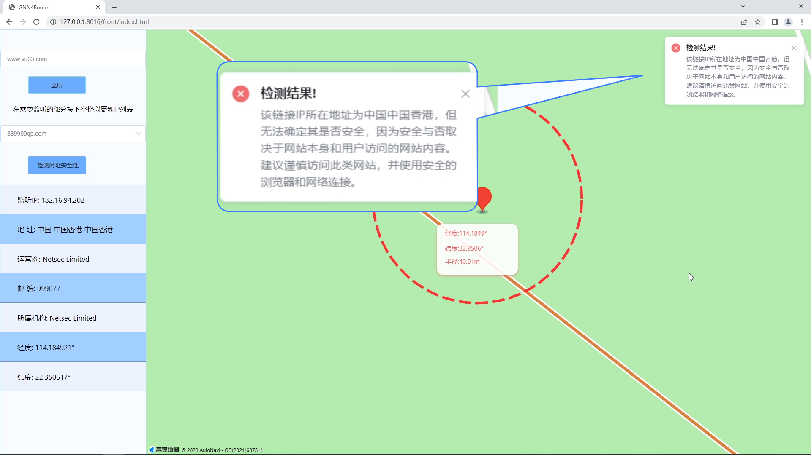

# 基于ChatGLM与LangChain的网页链接定位与安全检测系统

## 介绍
该项目使用项目[LangChain-Chatchat](https://github.com/chatchat-space/Langchain-Chatchat)作为LLM，价值使用高德地图API，埃文科技IP定位接口达到网页监听，链接捕捉和安全检测的功能。

## 依赖
该项目需要安装chrome浏览器和其对应的driver，也可由使用者自行更改另外的浏览器和对应的driver，Python版本为3.10.9，本项目主要使用LangChain-Chatchat的api.py，其端口设置为了7891，py文件夹下的[webContentRec.py](./py/webContentRec.py)用于启动网页监听。

## 效果图
网页监听功能效果如下:

链接捕捉功能效果如下:

可视化定位功能效果如下:

安全检测功能效果如下:

